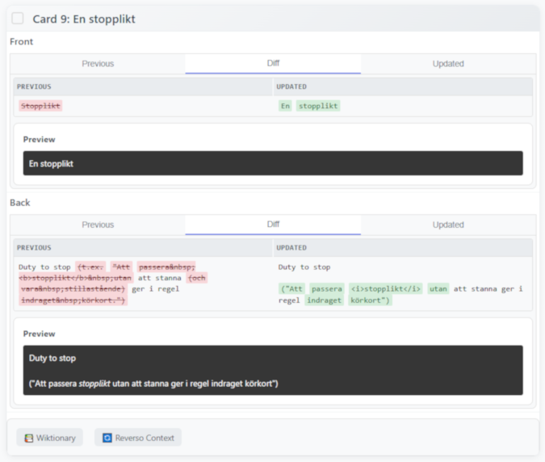

## Scripts for manipulating Anki decks

### anki_deck_fixer.py

Script & web interface for creating and improving Anki decks using the Claude API for semi-automated card processing.

The prompt sent by script is defined in "## Rules" section of the script.

Not expected to satisfy anyone but me!

